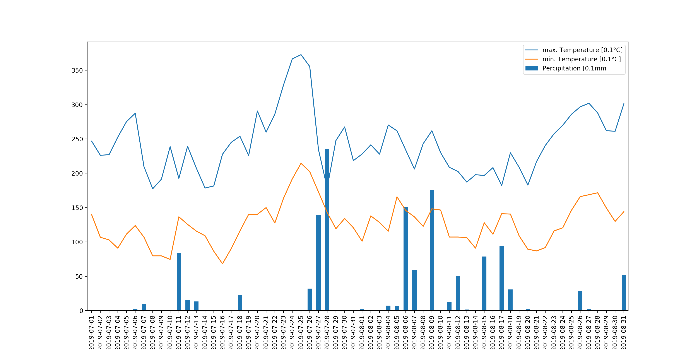

# Retrieve a time series for selected variables at a position

This DAPA endpoint returns a time series with daily observation values at the selected location (parameter `coord` or `coordRef`) in the selected time interval or at the selected time instant (parameter `datetime`).

The time series contains values for each selected variable (parameter `variables`) for which a value can be interpolated at the location.

## Sample requests

### Using coordinates for the location, requesting data for an instant

Percipitation and maximum/minimum temperatures on August 9, 2019, in Lieser, Germany.

```text
http://t16.ldproxy.net/ghcnd/collections/observation/dapa/position?
coord=POINT(7.0218 49.9174)&
datetime=2019-08-09&
variables=TMAX,TMIN,PRCP
```

[Request GeoJSON](http://t16.ldproxy.net/ghcnd/collections/observation/dapa/position?coord=POINT(7.0218%2049.9174)&datetime=2019-08-09&variables=TMAX,TMIN,PRCP&f=json)

[Request CSV](http://t16.ldproxy.net/ghcnd/collections/observation/dapa/position?coord=POINT(7.0218%2049.9174)&datetime=2019-08-09&variables=TMAX,TMIN,PRCP&f=csv)

### Using coordinates for the location, requesting data for an interval (time series)

Percipitation and maximum/minimum temperatures on 5 days in August 2019, in Lieser, Germany.

```text
http://t16.ldproxy.net/ghcnd/collections/observation/dapa/position?
coord=POINT(7.0218 49.9174)&
datetime=2019-08-07/2019-08-11&
variables=TMAX,TMIN,PRCP
```

[Request GeoJSON](http://t16.ldproxy.net/ghcnd/collections/observation/dapa/position?coord=POINT(7.0218%2049.9174)&datetime=2019-08-07/2019-08-11&variables=TMAX,TMIN,PRCP&f=json)

[Request CSV](http://t16.ldproxy.net/ghcnd/collections/observation/dapa/position?coord=POINT(7.0218%2049.9174)&datetime=2019-08-07/2019-08-11&variables=TMAX,TMIN,PRCP&f=csv)

### Using a reference for the location, requesting data for an instant

Percipitation and maximum/minimum temperatures on August 9, 2019, at a cadastral parcel in Bonn, Germany.

```text
http://t16.ldproxy.net/ghcnd/collections/observation/dapa/position?
coordRef=https%3A%2F%2Fwww.ldproxy.nrw.de%2Fkataster%2Fcollections%2Fflurstueck%2Fitems%2FDENW36AL10005X65FL&
datetime=2019-08-09&
variables=TMAX,TMIN,PRCP
```

[Request GeoJSON](http://t16.ldproxy.net/ghcnd/collections/observation/dapa/position?coordRef=https%3A%2F%2Fwww.ldproxy.nrw.de%2Fkataster%2Fcollections%2Fflurstueck%2Fitems%2FDENW36AL10005X65FL&datetime=2019-08-09&variables=TMAX,TMIN,PRCP&f=json)

[Request CSV](http://t16.ldproxy.net/ghcnd/collections/observation/dapa/position?coordRef=https%3A%2F%2Fwww.ldproxy.nrw.de%2Fkataster%2Fcollections%2Fflurstueck%2Fitems%2FDENW36AL10005X65FL&datetime=2019-08-09&variables=TMAX,TMIN,PRCP&f=csv)

### Using a reference for the location, requesting data for an interval (time series)

Percipitation and maximum/minimum temperatures in August 2019 in Washington, DC, USA.

```text
http://t16.ldproxy.net/ghcnd/collections/observation/dapa/position?
coordRef=https%3A%2F%2Fnominatim.openstreetmap.org%2Fsearch%3Fq%3DWashington%26format%3Dgeojson%26limit%3D1&
datetime=2019-08-01/2019-08-31&
variables=TMAX,TMIN,PRCP
```

[Request GeoJSON](http://t16.ldproxy.net/ghcnd/collections/observation/dapa/position?coordRef=https%3A%2F%2Fnominatim.openstreetmap.org%2Fsearch%3Fq%3DWashington%26format%3Dgeojson%26limit%3D1&datetime=2019-08-01/2019-08-31&variables=TMAX,TMIN,PRCP&f=json)

[Request CSV](http://t16.ldproxy.net/ghcnd/collections/observation/dapa/position?coordRef=https%3A%2F%2Fnominatim.openstreetmap.org%2Fsearch%3Fq%3DWashington%26format%3Dgeojson%26limit%3D1&datetime=2019-08-01/2019-08-31&variables=TMAX,TMIN,PRCP&f=json)

## Sample responses

### CSV

At an instant:

```csv
phenomenonTime,TMAX,TMIN,PRCP
2019-08-09,261.97275,148.28244,175.72902
```

For an interval, a time series:

```csv
phenomenonTime,TMAX,TMIN,PRCP
2019-08-31,326.22485,186.5174,1.8554863E-5
2019-08-30,299.9434,164.96535,0.2183162
2019-08-29,290.19263,181.47484,10.744431
2019-08-28,275.73703,190.04454,0.39175823
2019-08-27,249.96811,179.19333,1.7285985E-5
2019-08-26,254.65437,169.74426,3.914662E-9
2019-08-25,266.80197,169.72357,0.6220044
2019-08-24,252.26584,169.91318,60.580723
2019-08-23,309.53717,216.67346,46.07018
2019-08-22,348.21063,229.43196,19.694708
2019-08-21,347.32162,218.79291,98.5237
2019-08-20,357.6917,230.24718,47.368004
2019-08-19,356.72153,237.50298,0.0032744503
2019-08-18,342.5798,236.04352,3.8299541
2019-08-17,321.73395,232.62738,0.0013890546
2019-08-16,310.34668,224.90352,12.868282
2019-08-15,308.08978,237.34647,4.08197
2019-08-14,320.06943,233.05789,35.683617
2019-08-13,319.316,233.87689,2.407364
2019-08-12,310.0867,189.36937,1.0333144E-4
2019-08-11,293.19348,183.55244,0.0
2019-08-10,316.1553,179.15393,0.0
2019-08-09,332.17712,229.48021,0.0049290378
2019-08-08,343.6015,212.32523,186.5498
2019-08-07,339.2283,223.82373,145.55368
2019-08-06,325.06027,210.4592,0.006794223
2019-08-05,323.88538,218.16284,6.199424E-5
2019-08-04,331.6571,234.15137,2.254841
2019-08-03,318.93088,222.72612,2.552398E-4
2019-08-02,332.15082,219.27402,0.0
2019-08-01,319.9032,211.88776,0.012168143
```

### GeoJSON

At an instant:

```json
{
  "type" : "FeatureCollection",
  "features" : [ {
    "type" : "Feature",
    "geometry" : {
      "type" : "Point",
      "coordinates" : [ 7.0218, 49.9174 ]
    },
    "properties" : {
      "phenomenonTime" : "2019-08-09",
      "TMAX" : 261.97275,
      "TMIN" : 148.28244,
      "PRCP" : 175.72902
    }
  } ]
}
```

For an interval, a time series:

```json
{
  "type" : "FeatureCollection",
  "features" : [ {
    "type" : "Feature",
    "geometry" : {
      "type" : "Point",
      "coordinates" : [ 7.085770560342503, 50.71640207544834 ]
    },
    "properties" : {
      "phenomenonTime" : "2019-08-11",
      "TMAX" : 231.23917,
      "TMIN" : 132.63652,
      "PRCP" : 0.050290037
    }
  }, {
    "type" : "Feature",
    "geometry" : {
      "type" : "Point",
      "coordinates" : [ 7.085770560342503, 50.71640207544834 ]
    },
    "properties" : {
      "phenomenonTime" : "2019-08-10",
      "TMAX" : 259.5085,
      "TMIN" : 159.90451,
      "PRCP" : 0.0731554
    }
  }, {
    "type" : "Feature",
    "geometry" : {
      "type" : "Point",
      "coordinates" : [ 7.085770560342503, 50.71640207544834 ]
    },
    "properties" : {
      "phenomenonTime" : "2019-08-09",
      "TMAX" : 275.02377,
      "TMIN" : 149.30214,
      "PRCP" : 108.23
    }
  }, {
    "type" : "Feature",
    "geometry" : {
      "type" : "Point",
      "coordinates" : [ 7.085770560342503, 50.71640207544834 ]
    },
    "properties" : {
      "phenomenonTime" : "2019-08-08",
      "TMIN" : 134.923,
      "PRCP" : 0.31049046,
      "TMAX" : 237.01088
    }
  }, {
    "type" : "Feature",
    "geometry" : {
      "type" : "Point",
      "coordinates" : [ 7.085770560342503, 50.71640207544834 ]
    },
    "properties" : {
      "phenomenonTime" : "2019-08-07",
      "TMAX" : 246.96074,
      "TMIN" : 148.34018,
      "PRCP" : 35.399906
    }
  } ]
}
```

## Example use in python

Below is a simple plot created from the time series data for August 2019 for a location using python.

```python
import pandas as pd
import geopandas as gpd
import matplotlib.pyplot as plt

baseUrl = 'http://t16.ldproxy.net/ghcnd/collections/observation/dapa'
lon = '7.0218'
lat = '49.9174'
datetime = '2019-07-01/2019-08-31'
variables = 'TMIN,TMAX,PRCP'
# either read as GeoJSON into GeoPandas or as CSV into Pandas
# ghcnd = gpd.read_file(baseUrl+'/position?coord=POINT('+lon+'%20'+lat+')&datetime='+datetime+'&variables='+variables+'&f=json')
ghcnd = pd.read_csv(baseUrl+'/position?coord=POINT('+lon+'%20'+lat+')&datetime='+datetime+'&variables='+variables+'&f=csv')
pos = ghcnd
pos.index = pos.phenomenonTime
fig, ax = plt.subplots(figsize=(16, 8))
pos.TMAX.plot(label='max. Temperature [0.1°C]', legend='best').invert_xaxis()
pos.TMIN.plot(label='min. Temperature [0.1°C]', legend='best').invert_xaxis()
pos.PRCP.plot(kind='bar', label='Percipitation [0.1mm]', legend='best').invert_xaxis()
plt.show()
```



---
[BACK](README.md)
